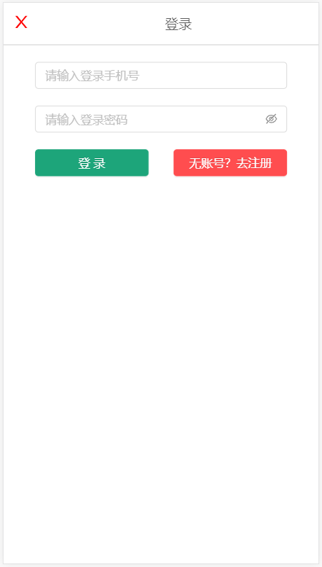

# LeCunTao

## 项目名称:乐村淘 

* git仓库地址
    * https://github.com/gzh51906/LeCunTao.git

* 团队与分工
    * 组长:邵展荣 组员:邢福谦,陈燕伟,何启维
    * 负责模块
        * 邵展荣:搭建项目,后台管理系统
        * 邢福谦:个人页,登陆注册页,列表页,详情页
        * 陈燕伟:分类页
        * 何启维:首页

* 项目目录说明
```
├── build
|  ├── asset-manifest.json
|  ├── favicon.ico
|  ├── img
|  ├── index.html
|  ├── logo192.png
|  ├── logo512.png
|  ├── manifest.json
|  ├── precache-manifest.3b4f905ed75b46009afdf93477c3d358.js
|  ├── robots.txt
|  ├── service-worker.js
|  └── static
├── config
|  ├── env.js
|  ├── jest
|  ├── modules.js
|  ├── paths.js
|  ├── pnpTs.js
|  ├── webpack.config.js
|  └── webpackDevServer.config.js
├── config-overrides.js
├── list.txt
├── manage
├── package-lock.json
├── package.json
├── public
|  ├── favicon.ico
|  ├── img
|  ├── index.html
|  ├── logo192.png
|  ├── logo512.png
|  ├── manifest.json
|  └── robots.txt
├── README.md
├── router
|  ├── node_modules
|  ├── package-lock.json
|  ├── package.json
|  └── src
├── scripts
|  ├── build.js
|  ├── start.js
|  └── test.js
├── src
|  ├── App.css
|  ├── App.js
|  ├── App.test.js
|  ├── assets
|  ├── doc
|  ├── img
|  ├── index.css
|  ├── index.js
|  ├── logo.svg
|  ├── pages
|  ├── redux
|  └── serviceWorker.js
└── yarn.lock
```
* 项目页面截图
    * 
    
    
    
    
